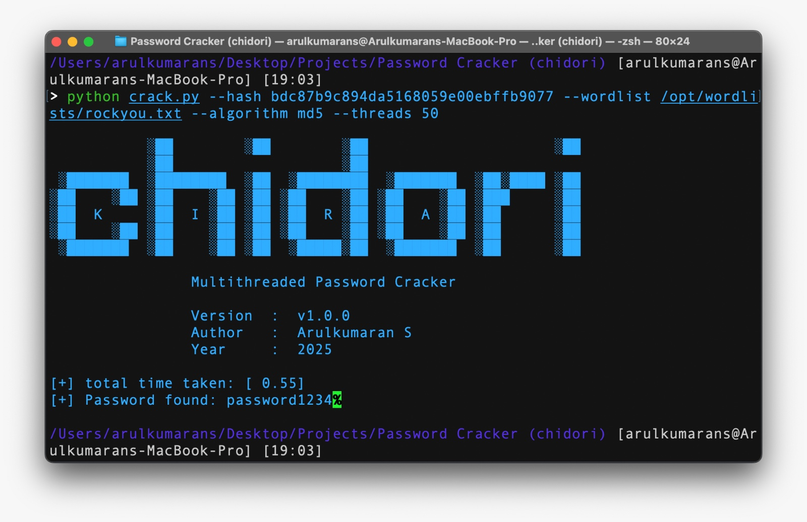

# Chidori 

--- 

## Requirements 

- Python 3.8+ 
- `numpy` library

```txt
numpy>=1.20; python_version >= "3.8"
```

---

## Installation

clone the repository
```
git clone https://github.com/arul637/chidori.git
```

change to `chidori` directory.
```
cd chidori
```

install the necessary requirements.
```
pip install -r requirements.txt
```

---

## Guide

```
python crack.py \
  --algorithm md5 \
  --hash 482c811da5d5b4bc6d497ffa98491e38 \
  --wordlist /opt/wordlists/rockyou.txt \
  --threads 16
```

```
python crack.py \
  --algorithm md5 \
  --hash-file /path/to/hash.txt \
  --wordlist /opt/wordlists/rockyou.txt \
  --threads 8
```

**Flags:**

    - `--hash` : target hash value (string).
    - `--hash-file` : path to file containing the hash (one hash per file — current code reads the whole file into a string).
    - `--algorithm` : hashing algorithm (required).
    - `--wordlist` : path to wordlist file (required).
    - `--threads` : number of worker threads (default 25).

---

## Supported Algorithm

Chidori is a compact, multithreaded password-cracking utility that divides a wordlist into chunks and assigns each chunk to a worker thread to compare candidate passwords against a target hash. It’s designed for learning and small-scale testing — it prioritizes simplicity and clarity over high-performance optimizations. Use this tool only on hashes and systems you own or have explicit permission to test. Future versions will add streaming wordlist support, better progress reporting, and more robust algorithm handling.

currently it support only few hash algorithms, we working on it to improve the performance and possible new algorithms. 

    - `md5`
    - `sha-1`, `sha-224`, `sha-256`, `sha-384`, `sha-512`
    - `sha3-224`, `sha3-256`, `sha3-384`, `sha3-512`
    - `blake-2b`, `blake-2s`
    - `shake-128`, `shake-256`

---

## Examples

```
python crack.py --hash bdc87b9c894da5168059e00ebffb9077 --algorithm md5 --threads 50 --wordlist /opt/wordlists/rockyou.txt
```



```
python crack.py --hash 65cc4dc419937e5c0e256c8e5692d2c3f04585c8a548e40cce965e146aaa492d1775bd6219e0126ef8333c833edc0299 --algorithm sha-384 --threads 50 --wordlist /opt/wordlists/rockyou.txt
```
